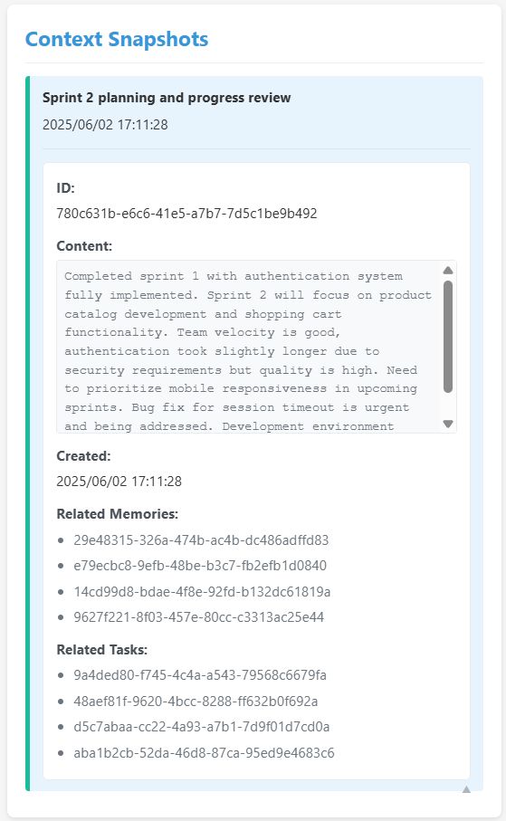

# MCP Memory & Task Management Server

## Overview

This is a complete implementation of a Model Context Protocol (MCP) server, providing memory and context management, as well as task and progress tracking functionalities. The server adopts a modular design and emphasizes a local-first data storage strategy.

## Features

### Memory & Context Management Module
- **Persistent Memory**: Local JSON file storage to ensure data privacy
- **Semantic Search**: Similarity calculation based on token overlap
- **Context Snapshots**: Automatically records and indexes context information
- **Tagging System**: Supports memory categorization and filtering

### Task & Progress Tracking Module
- **Task CRUD**: Full lifecycle management for tasks
- **Status Tracking**: todo, in progress, completed, cancelled
- **Priority Management**: Three levels—low, medium, high
- **Progress Notes**: Timestamped progress update records
- **Task Dependencies**: Support for task dependency relationships with `depends_on` field
- **Dependency Validation**: Prevents circular dependencies and validates executable tasks
- **Semantic Linking**: Mechanism to associate tasks with memories

## Installation & Setup

### Environment Requirements
```bash
npm install @modelcontextprotocol/sdk
npm install typescript ts-node
```

## Test Server (MCP Inspector)

```bash
npx @modelcontextprotocol/inspector ts-node index.ts
```

## Run Server

```bash
# Development mode
npm run dev

# Production mode
npm run build
npm start

# npx execution
npm run build
npx server-memory-task

# local server
npm run build
npm link
mcp-server-memory-task
```

## Add Memory & Task Management Server to MCP Client
```
node {path}/dist/index.js --env MCP_DATA_DIR={path}/mcp_data
```

## Web Viewer Dashboard

The server includes a web-based monitoring dashboard that provides real-time insights into the system's operations. To access the dashboard:

1. Start the server in development mode: `node web-viewer/server.js --data-dir {mcp_data_dir}`
2. Open your browser to `http://localhost:8080`

The dashboard provides three distinct views:

### List View (Default)
- **System Overview**: Real-time statistics and metrics
- **Task Management**: Complete task listing with expandable details
- **Memory Management**: Browse and search through stored memories
- **Context Snapshots**: Recent context captures with timestamps

### Kanban Board View
- **Visual Task Flow**: Drag-and-drop style task management
- **Status Columns**: Todo, In Progress, and Completed sections
- **Progress Tracking**: Real-time completion rate visualization
- **Task Cards**: Compact view with priority indicators

### Dependencies View
- **Dependency Visualization**: Clear view of task relationships
- **Status Badges**: Color-coded task IDs showing current status
  - 🔴 Todo: Red badges for pending tasks
  - 🟡 In Progress: Orange badges for active tasks
  - 🟢 Completed: Green badges for finished tasks
  - ⚪ Cancelled: Grey badges for cancelled tasks
- **Blocking Relationships**: Shows which tasks are blocked by dependencies
- **Interactive Details**: Expandable rows with complete task information

  
*Example monitoring interface*

### Kanban Board
 

### Dependencies
 

### Key Features
- **Real-time Updates**: WebSocket-powered live data synchronization
- **Multi-View Interface**: List, Kanban, and Dependencies views
- **Visual Status Indicators**: Color-coded badges and progress bars
- **Task Relationship Management**: Dependency tracking and validation
- **Interactive UI**: Expandable details and hover effects
- **Responsive Design**: Mobile-friendly interface

> Note: The monitoring page requires the web-viewer component to be running. See the "Run Server" section for startup instructions.

### Project Structure
```
├── src/
│   ├── config.ts             # Configuration management
│   ├── logger.ts             # Logging utilities
│   ├── index.ts              # Entry point
│   ├── server.ts             # MCP Server implementation
│   ├── memory.ts             # Memory service + storage
│   ├── task.ts               # Task service + storage
│   ├── context.ts            # Context service + storage
│   ├── utils.ts              # Utility functions
│   └── types.ts              # Type definitions
├── web-viewer/
│   ├── server.js             # Web dashboard server
│   └── public/
│       ├── index.html        # Dashboard HTML
│       ├── app.js            # Frontend JavaScript
│       └── style.css         # Dashboard styles
├── package.json              # Dependencies and scripts
├── tsconfig.json             # TypeScript configuration
└── README.md                 # Documentation
```

## MCP Usage Guide

### Memory Management

#### Unified Memory Tool
```json
{
  "tool": "memory_tool",
  "arguments": {
    "operation": "create",
    "content": "Meeting notes: Discussed new product feature planning",
    "summary": "Product feature meeting notes",
    "tags": ["meeting", "product"],
    "context_id": "optional-context-id"
  }
}

{
  "tool": "memory_tool",
  "arguments": {
    "operation": "search",
    "query": "product feature",
    "limit": 5
  }
}

{
  "tool": "memory_tool",
  "arguments": {
    "operation": "list",
    "tags": ["meeting"]
  }
}

{
  "tool": "memory_tool",
  "arguments": {
    "operation": "delete",
    "id": "memory-id"
  }
}
```

### Task Management

#### Unified Task Tool
```json
{
  "tool": "task_tool",
  "arguments": {
    "operation": "create",
    "title": "Complete product prototype",
    "description": "Build the product prototype based on meeting discussions",
    "priority": "high",
    "tags": ["development", "prototype"],
    "due_date": "2024-12-31T23:59:59Z",
    "linked_memories": ["memory-id-1", "memory-id-2"],
    "depends_on": ["task-id-1", "task-id-2"]
  }
}

{
  "tool": "task_tool",
  "arguments": {
    "operation": "update",
    "id": "task-id",
    "status": "in_progress",
    "progress_note": "Initial design completed"
  }
}

{
  "tool": "task_tool",
  "arguments": {
    "operation": "read",
    "id": "task-id"
  }
}

{
  "tool": "task_tool",
  "arguments": {
    "operation": "list",
    "status": "in_progress",
    "priority": "high"
  }
}
```

### Context Management

#### Create Context Snapshot
```json
{
  "tool": "create_context_snapshot",
  "arguments": {
    "summary": "Product development discussion context",
    "content": "Detailed conversation content...",
    "related_memories": ["memory-id-1"],
    "related_tasks": ["task-id-1"]
  }
}
```

### System Overview

#### Get System Overview
```json
{
  "tool": "overview",
  "arguments": {}
}
```

## Data Formats

### Memory Format
```json
{
  "id": "uuid-string",
  "content": "Memory content",
  "summary": "Memory summary",
  "embedding": [],
  "metadata": {
    "created_at": "2024-01-01T00:00:00Z",
    "updated_at": "2024-01-01T00:00:00Z",
    "tags": ["tag1", "tag2"],
    "context_id": "related-context-id"
  }
}
```

### Task Format
```json
{
  "id": "uuid-string",
  "title": "Task title",
  "description": "Task description",
  "status": "todo|in_progress|completed|cancelled",
  "priority": "low|medium|high",
  "tags": ["tag1", "tag2"],
  "created_at": "2024-01-01T00:00:00Z",
  "updated_at": "2024-01-01T00:00:00Z",
  "due_date": "2024-12-31T23:59:59Z",
  "linked_memories": ["memory-id-1", "memory-id-2"],
  "depends_on": ["prerequisite-task-id-1", "prerequisite-task-id-2"],
  "progress_notes": [
    "2024-01-01T00:00:00Z: Progress note 1",
    "2024-01-02T00:00:00Z: Progress note 2"
  ]
}
```

## Integration Recommendations

### Integrating with MCP Client
1. Add this server to the MCP client configuration
2. Use the stdio protocol for communication
3. Manage memories and tasks via tool invocation MCP

### Extension Features
1. **Scheduling**: Add scheduled task reminders
2. **Collaboration**: Multi-user memory and task sharing
3. **Backup & Sync**: Cloud backup and ...

## Performance Optimizations

### Implemented Optimizations
1. **LRU Cache**: Memory cache with size limits and expiration policies
2. **Batch Operations**: Efficient batch processing to reduce database access
3. **Async I/O**: All file operations use asynchronous patterns for better performance
4. **Error Handling**: Unified error handling strategy with detailed error logging

### Future Optimizations
1. **Database** Migration: Option to use SQLite or other databases for larger datasets
2. **Pagination**: Add pagination support for large result sets
3. **Compression**: Implement data compression for memory storage
4. **Worker Threads**: Use worker threads for CPU-intensive operations

### Task Management Interface
   
*Example task management interface*

### Memory Management Interface
   
*Example memory management interface*

### Context Snapshots Interface
   
*Example context snapshots interface*

## Development Guidelines

### Code Structure
- Follow the three-layer architecture: Storage Layer, Service Layer, and MCP Layer
- Each class should have a single responsibility
- Use dependency injection for better testability

### TypeScript Best Practices
- Use strict typing and avoid `any` where possible
- Define interfaces for all MCP parameters and return values
- Use generics for reusable components

### Testing
- Unit tests for all services and utilities
- Integration tests for MCP endpoints
- Run tests with `npm test`
